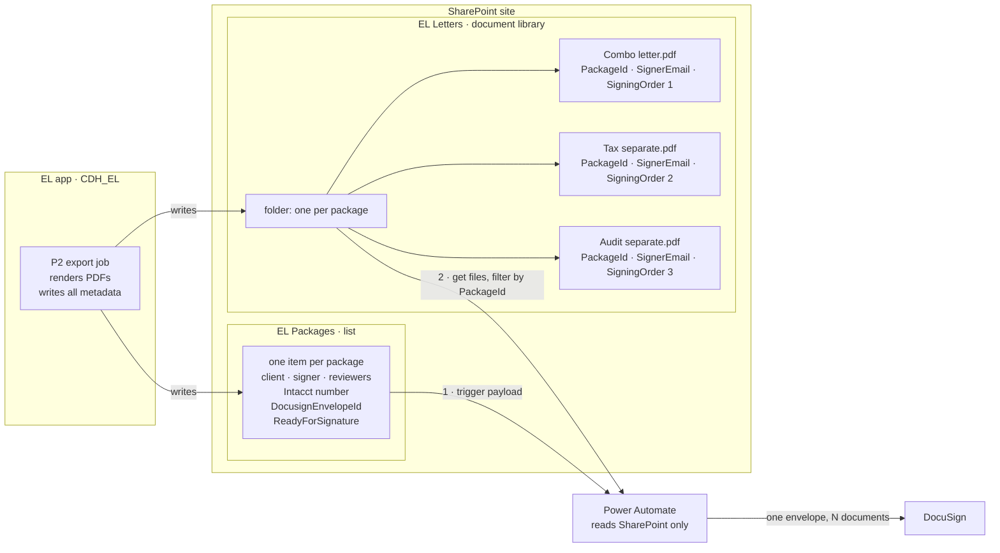
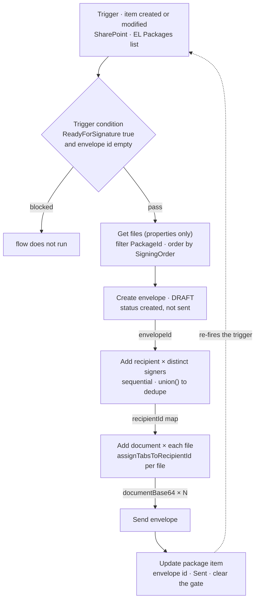

# EL SharePoint Structure and DocuSign Brief

**Status (2026-08-17):** Discussion brief, not a warplan. Written to prep the team email/discussion on how EL packages are laid out in SharePoint and how Power Automate turns that layout into one DocuSign envelope. Companion to the [[04_Projects/Active/EL/EL Index|SharePoint export plan set]] (P0–P3) — this note covers the handoff those plans stop short of.

> [!info] Scope
> **Outbound only:** SharePoint structure and the send-for-signature flow.
> The **status return path** — DocuSign envelope status flowing back into SharePoint and then into SQL — is deliberately excluded and needs its own discussion. Nothing in P0–P3 builds it today.

## Where this sits

| Phase | Plan | State |
|---|---|---|
| **P0** | [[04_Projects/Active/EL/EL Document Approval Workflow Warplan\|Document Approval Workflow]] | Done. A package reaches `Approved` only when every letter is `PartnerApproved`. |
| **P1** | [[04_Projects/Active/EL/EL SharePoint Client Warplan\|SharePoint Client]] | Done, uncommitted on `Drew/Sprint4/SharePoint-Client`. Graph client, field mapper, mirror table. |
| **P2** | [[04_Projects/Active/EL/EL SharePoint Export Job Warplan\|Export Job]] | Not started. Renders PDFs, uploads, writes the list item. |
| **P3** | [[04_Projects/Active/EL/EL SharePoint Export UI Warplan\|Export UI]] | Not started. Likely lighter than planned — the send gate may already exist via `PackageState.Approved`. |

The EL SharePoint site, list, and document library **do not exist yet**. Every Graph internal column name in the code today is a placeholder, all kept in `Lib/Models/EL/ELPackageSpListItem.cs` so relisting is a one-file edit once the real names are known.

## The grain: one list item and one folder per package

FPA maps one list item to one file. EL cannot — a package holds several letters (a combo letter plus separates), so the export produces N PDFs from one package.

- **One list item per package**, holding everything the same for every letter in it: client, reviewers, Intacct customer number, signer, envelope id and status. Enforced by a unique index on `package_id`.
- **One drive folder per package**, flat at the library root, holding every letter PDF. The list item carries the *folder* link, not a file link — a package-level row cannot sensibly point at one of N files.
- **Per-letter file links stay on `ELDocumentFile`** in SQL. That table already has `sp_id`, `web_url`, `file_path`, and `checksum` columns with no writers.
- **Per-letter routing metadata goes on the files themselves** as SharePoint library columns. This is the new piece, and most of this brief is about it.



**Both of Power Automate's inputs are SharePoint.** Nothing is read from the EL app or its database at flow time — the export job pushes everything into SharePoint first, and the flow reads it from there. There is no callback path from Power Automate into EL.

- The EL app writes the list item via `AddOrUpdateListItemAsync`, and the folder plus files via `EnsureFolderAsync` / `UploadFileAsync` / the new `UpdateFileFieldsAsync`.
- Package-level fields arrive **free in the trigger payload** — no separate "get item" action. Note that Person columns come back as nested objects (`triggerBody()?['RMReviewer']?['Email']`), not flat strings.
- Per-file routing needs one extra action, *Get files (properties only)*, filtered on `PackageId` taken from that payload. It returns metadata only; file bytes need a separate *Get file content* per file inside the loop.
- `PackageId` lives **on the files**, not on the list item as a pointer. It is the join key the flow filters by, so the flow never parses folder paths and survives folder renames.

> [!warning] `PackageId` must be an indexed library column
> Filtering a non-indexed column in a library past 5,000 items throws the list view threshold error. It works fine in testing and breaks once the library fills up. Cheap at provisioning, painful to retrofit.

> [!info] The SharePoint item trigger polls
> It is not a webhook. Expect a poll-interval delay between the EL action and the DocuSign email landing — worth setting expectations before anyone demos this.

Consequence worth stating plainly: **if a field is blank in SharePoint, the flow cannot recover it.** There is no fallback path to ask EL. That is why P2 validates collect-all-errors style *before* touching SharePoint — the flow's correctness depends entirely on the export having been complete.

## One envelope per package, routed per document

Recommended grain: **one DocuSign envelope per package**, with per-document recipient routing inside it — not one envelope per letter.

- The package is already the unit of everything upstream. P0's workflow only reaches `Approved` when every letter is `PartnerApproved`. Splitting the signing step fragments a unit the workflow spent its whole life enforcing.
- DocuSign does not force a choice between one envelope and independent signers. A single envelope can hold multiple documents **and** assign tabs per document to different recipients, so consolidating costs no granularity.
- One envelope is a better client experience than three separate DocuSign emails for what is, from their side, one engagement.

> [!question] Needs a business answer
> The one legitimate reason to split into per-letter envelopes is if legal treats each letter as a separately binding instrument requiring its own independent consent record. That is not an engineering call.

## Columns

### Package list — exists in code today

Mapped on `ELPackageSpListItem`. The `[GraphField]` names are placeholders until the list is provisioned.

| Graph column | Type | Notes |
|---|---|---|
| `Title` | Text | |
| `Status` | Text | |
| `ClientName` | Text | |
| `RMReviewerLookupId` | Person | Internal staff — resolves correctly |
| `PartnerReviewerLookupId` | Person | Internal staff — resolves correctly |
| `ClientSignerName` | Text | |
| `ClientSignerEmail` | Text | External — deliberately not a Person column |
| `IntacctCustomerNumber` | Text | Real mangled internal name still unknown |
| `DocusignEnvelopeId` | Text | Written by the flow, not by EL |
| `DocusignStatus` | Text | Written by the flow, not by EL |

Also on the SQL mirror row but intentionally **not** pushed to SharePoint: `letter_count`, `folder_sp_id`, `folder_web_url`, `folder_file_path`, `date_exported_utc`, `export_error`.

### Package list — one column to add

| Column | Type | Why |
|---|---|---|
| `ReadyForSignature` | Yes/No | The flow's gate. Its own column rather than inferred from `Status`, so the trigger condition can be exact. |

### Document library — all new

These make per-document routing possible. Power Automate reads them natively through *Get files (properties only)*.

| Column | Type | Purpose |
|---|---|---|
| `PackageId` | Number | Join key. The flow filters on this instead of parsing folder paths. |
| `DocumentTitle` | Text | Clean name in the envelope's document list, separate from the sanitized filename. |
| `SigningOrder` | Number | Deterministic document order inside the envelope. |
| `SignerName` | Text | |
| `SignerEmail` | Text | Must be Text, never Person — see below. |
| `RoutingOrder` | Number | Sequential vs parallel signing when signers differ across letters. |
| `LetterType` | Text | Only needed if we go the DocuSign-template route for tab placement. |
| `DocuSignDocumentId` | Number | Written back by the flow: which document number this file became. |

> [!warning] Why signer columns must be Text, not Person
> The mapper's Person lookup resolves through the site's *User Information List* (`ElSharePointContext.cs:323`) — only internal users with site access. An external client signer is not there, so the lookup silently fails, logs a warning, and writes the raw email as text anyway (`GraphFieldMapper.cs:122`). A Person column would degrade to text without telling anyone.
> The existing entity already gets this right: reviewers are `LookupTypes.User`, client signer is plain text.

### Why per-file columns and not the alternatives

- **Signer in the filename** — puts a client email into a SharePoint URL, leaks it into logs and links, breaks on rename.
- **A JSON blob on the package list item** — forces the flow to match entries back to files by filename, exactly the string P2's sanitizer is allowed to mangle.
- **The flow calling an EL API** to ask who signs a letter — adds an authenticated dependency mid-flow and leaves the library non-self-describing; a human opening it cannot see routing.
- **Per-file columns** — read natively by Power Automate, filterable and sortable, visible in a library view, and troubleshooting becomes "look at the row."

## Code gaps in the P1 client

The client as built cannot write file metadata at all. Four things to close:

1. **`UploadFileAsync` takes no fields** (`ElSharePointContext.cs:86`). It PUTs content and returns id, name, web url, path. Add a separate `UpdateFileFieldsAsync` that PATCHes `drives/{driveId}/items/{id}/listItem/fields`. Keeping it separate rather than adding a parameter to upload is honest — custom columns cannot ride the content PUT, so it is two Graph calls either way, and it mirrors the shape of `AddOrUpdateListItemAsync`.
2. **`AddOrUpdateListItemAsync` cannot be reused for the library** (`:237`). It is bound to the single configured `ListName` through a cached list id. The document library is a different list.
3. **The field mapper stringifies every value.** Numeric columns like `SigningOrder` would arrive as `"1"`. Whether Graph coerces that for a Number column is **unverified**; correct fix is to teach the mapper to pass numeric primitives through.
4. **The mapper cannot clear a column.** It skips null/whitespace by design, so a blank local value never blanks a SharePoint column.

The new mapped model for file fields needs no mapper changes beyond point 3 — `ToFieldsAsync<T>` is already an unconstrained generic and works on any annotated type.

## The Power Automate flow



The dotted edge is the flow's own write-back re-entering its trigger.

> [!danger] The one hazard that will bite us
> The flow updates the same list item it triggers on. A modify-triggered flow that writes back to its own trigger item runs forever. The trigger condition is not optional polish — it is what makes the design safe:
> ```
> @and(equals(triggerBody()?['ReadyForSignature'], true),
>      empty(triggerBody()?['DocusignEnvelopeId']))
> ```

### Steps

1. **Trigger.** SharePoint *When an item is created or modified* on the EL Packages list, with the condition above.
2. **Get files (properties only)** on the EL Letters library, filtered `PackageId eq <trigger PackageId>`, ordered by `SigningOrder`. This is the action that returns custom columns.
3. **Guard.** No files returned means the export never ran or ran badly. Write the reason to the item and terminate as failed rather than sending an empty envelope.
4. **Create envelope as a draft** — status `created`, not `sent`. Subject and body from the package item.
5. **Build the distinct signer set** from step 2 with a Select over `SignerEmail`/`SignerName`, then `union()` to dedupe. Power Automate has no native distinct.
6. **Add recipient** per distinct signer, capturing each returned `recipientId` into a map of email to id. Concurrency off — recipient ids must be deterministic.
7. **Add document** per file, in `SigningOrder`, concurrency off. Get file content, base64 it, call add-document with `documentBase64`, `fileExtension`, `name` from `DocumentTitle`, and `assignTabsToRecipientId` looked up from step 6 by that file's `SignerEmail`. Write `DocuSignDocumentId` back onto the file.
8. **Send envelope** — flips the draft to sent.
9. **Update the package item**: envelope id, status `Sent`, clear `ReadyForSignature`.
10. **Failure scope** configured to run after steps 4–8 have failed, writing the failure onto the package item so it surfaces in the list and in the EL UI.

### DocuSign connector parameters (add document to envelope)

`accountId`, `envelopeId`, `documentBase64`, `fileExtension`, `name`, `transformPdfFields`, `assignTabsToRecipientId`.

> [!important] Two structural requirements
> **Draft, then add, then send.** A single create-and-send action cannot attach N documents with per-document recipient routing. The three-step split is what makes multi-letter envelopes possible at all.
>
> **Both loops sequential.** Recipient ids must be deterministic, and document order in the envelope must match `SigningOrder`. Parallel iteration breaks both.

## Open decisions

### 1. Where do signature tabs land?

`assignTabsToRecipientId` assigns tabs to a recipient but does not say where on the page a signature goes. This choice decides whether the EL renderer or DocuSign owns placement.

| Route | Placement owned by | Trade-off |
|---|---|---|
| `transformPdfFields` with named form fields in the PDF | EL renderer | Cleanest — placement travels with the PDF. **Unverified** whether our GemBox render path emits AcroForm fields at all. |
| Anchor strings in the letter template | EL templates | Standard DocuSign practice, but the connector's add-document action does not expose anchor config; may need the raw API. |
| DocuSign templates per `LetterType` | DocuSign, by business users | Most self-serve. Highest drift risk between EL templates and DocuSign templates. |
| HTTP action to the DocuSign REST API | The flow | Full envelope-definition control, loses the connector's conveniences. |

### 2. Where does a per-letter signer come from?

EL has no per-letter signer today — `FpaDetailDto.Contact` carries one contact per FPA, which is one per package.

- **Option A, recommended.** Populate every file's signer columns with the package's FPA contact. Columns exist, the flow is fully per-document capable, behavior identical to today. Nothing changes in the EL UI.
- **Option B.** Add a per-document signer override in `ElPackageWorkspace` plus a column on `ELDocument`.

A is the right build now: it makes the structure and flow correct for mixed signers without waiting on a business decision, and B later becomes "populate a column differently" rather than a restructure.

### 3. Upstream correctness — read before anything gets sent

> [!danger] Biggest risk in the whole set, and it sits upstream of everything in this brief
> `BuildMergeFieldValues` in `ElPackageWorkspace.razor:401` populates exactly **two** fields — `client.name` and `service.line`. Everything else in the ~70-field catalog resolves to an unresolved finding.
>
> Exporting today would put client-facing PDFs with blank client names and fees into a DocuSign envelope. The export must treat unresolved merge fields as a **hard failure**, and that logic has to move out of the component before a background job can reach it at all (a job has no circuit and no component).
>
> Already tracked as a decision gate in [[04_Projects/Active/EL/EL SharePoint Export Job Warplan|P2]] Task 3.

## Prerequisites

1. EL SharePoint site, list, and document library provisioned, with every column above created.
2. Real internal column names captured and pasted into `ELPackageSpListItem.cs` — all in one file, so a single edit.
3. Graph app registration with `Sites.Selected` plus a site grant, or `Sites.ReadWrite.All`, admin-consented.
4. Client secret in `appsettings.Development.local.json` only. Both tracked settings files must keep it empty. The integration defaults to **disabled** — anything other than `"False"` for `SharePoint:IsDisabled` keeps it off, which is the expected state until provisioning.
5. Power Automate connections for SharePoint and DocuSign, plus the DocuSign account id.
6. P2 built — nothing reaches SharePoint until the export job exists.

## Config surface

`SharePoint` section: `TenantName`, `SiteName`, `ListName`, `DriveName`, `IsDisabled`.
`SharePoint:Azure:AppRegistration`: `TenantId`, `ClientId`, `ClientSecret`.

## Status Log

- 2026-08-17 — Brief authored for the team email/discussion. Verified against branch `Drew/Sprint4/SharePoint-Client`: `UploadFileAsync` has no fields parameter, `AddOrUpdateListItemAsync` is welded to the configured `ListName`, and `GraphFieldMapper` both stringifies values and refuses to write blanks — so per-file routing columns cannot be written by the P1 client as it stands. Confirmed the DocuSign connector's add-document action accepts `documentBase64` + `assignTabsToRecipientId` per call, which is what makes one-envelope-many-documents viable. Two items left unverified and flagged as such: whether Graph coerces string values into Number columns, and whether the GemBox render path emits AcroForm fields (that one decides the tab-placement route).

## Links

- [[04_Projects/Active/EL/EL Index|EL Index]]
- [[EL|EL]]
- [[04_Projects/Active/EL/EL SharePoint Client Warplan|P1 — SharePoint Client Warplan]] (the client this brief extends)
- [[04_Projects/Active/EL/EL SharePoint Export Job Warplan|P2 — Export Job Warplan]] (produces what the flow consumes)
- [[04_Projects/Active/FPA|FPA]] — source of the ported SharePoint design, and the one-item-one-file grain this diverges from
